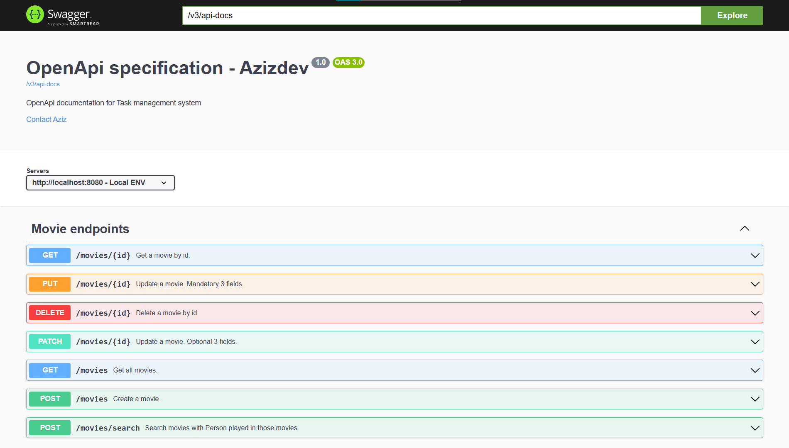
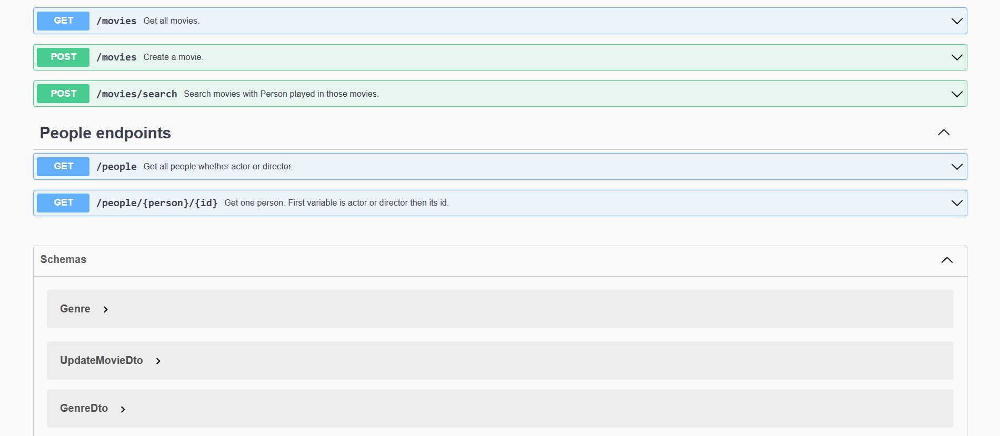

# Movies
The backend part of a movie's website like IMDb (https://www.imdb.com/). We will only focus on the backend side.
System has creation, editing, deleting and viewing movies endpoints.

## Features
* All CRUD operations of movies
* Covered with Unit tests
* Searching movies

## Technologies
* Spring Boot 3.0
* Spring Validation
* Project Lombok
* Mapstruct
* Postgresql
* H2 database
* Spring doc (Swagger UI & Open API)
* Docker

## Getting Started
To get started with this project, you will need to have the following installed on your local machine:

* JDK 17+
* Maven 3+
* Docker

To build and run the project, follow these steps:

* Clone the repository: `git clone https://github.com/AzizDeveloper/movies`
* Build the project: mvn clean install
* Insert the data into db: mvn liquibase:update
* Run the project: mvn spring-boot:run

-> The application will be available at http://localhost:8080.

Screenshots of swagger-ui:

